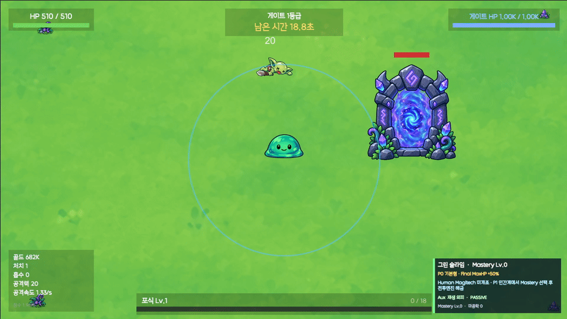
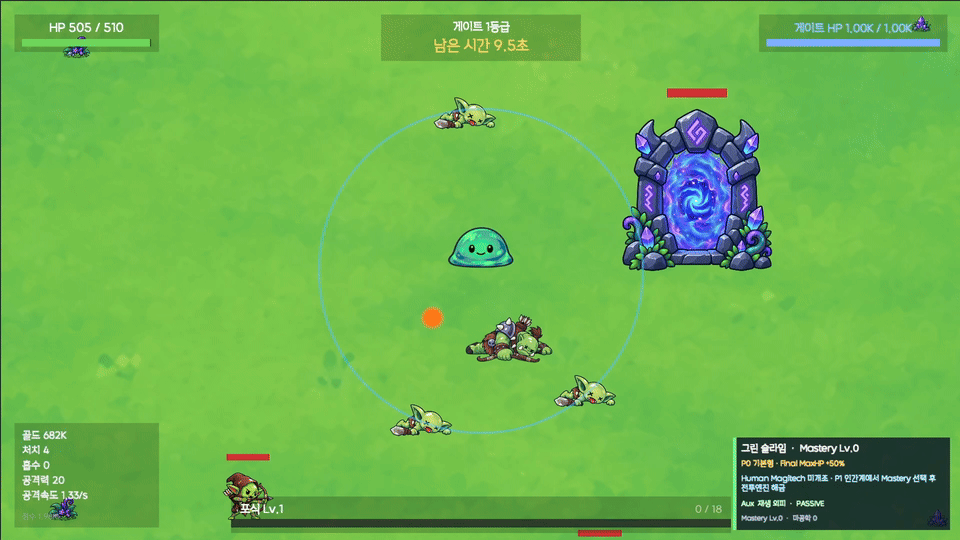

# Slime Combat Showcase

> **Pre-Public-Playable Combat Snapshot**  
> `슬라임은 먹고싶어`의 실제 전투 구현과 개발 의도를 기록하는 포트폴리오 페이지입니다.

이 저장소는 Unity 프로젝트 소스를 복제하지 않습니다. 완성 전 단계에서 무엇을 만들고 있으며, 어떤 전투 경험을 목표로 하는지와 실제 화면을 간결하게 보여 주기 위한 별도의 소개 공간입니다.

## Combat Preview — 게이트 원정 전투 HUD

**README 자동 재생 GIF · Unity Play Mode Game View · 960×540 · 5초**



R1 게이트 원정의 실제 플레이 모드 화면입니다. 슬라임의 체력·공격 반경, 게이트 체력, 남은 시간, 포식 진행도, 마스터리 패널을 유지한 채 적 접근·투사체·처치 상태가 함께 읽히는 구간을 담았습니다. Unity Editor·Console·Inspector는 포함하지 않았습니다.

GIF는 저장소 첫 화면에서 바로 반복 재생되는 5초 요약본입니다. 연출용 콘셉트 영상이나 완성 트레일러가 아니라, 현재 구현이 어떤 화면과 루프로 동작하는지를 보여 주기 위한 런타임 증거입니다.

```text
전투 진입 → 슬라임 기본 공격 → 적 공격 또는 피격 반응 → 적 처치·흡수
```

영상은 완성된 게임 트레일러가 아니라, 현재 구현된 전투의 감각과 제작 방향을 보여 주는 **Combat Snapshot**으로 공개합니다.

## 플레이 흐름 — 포식 → 변이 카드 선택

**README 자동 재생 GIF · Unity Play Mode Game View · 960×540 · 5초**



같은 R1 원정에서 포식이 진행되고 변이 카드 선택이 열리는 실제 플레이 녹화입니다. 카드를 골라 적용되는 결과까지 한 클립으로 확인할 수 있습니다.

포식 처리와 카드 선택은 실제 게임 시스템과 실제 선택 UI를 통해 발생합니다. GIF는 포식 후 카드 선택이 열리고, 선택 뒤 전투로 돌아오는 흐름을 한 번에 보이도록 잘라낸 5초 루프입니다. 아직 장시간 무편집 플레이 영상은 아니며, 현재 공개본은 핵심 루프를 짧고 명확하게 확인하기 위한 기록입니다.

## 기획과 성장 구조 — 접어보기

아래 내용은 내부 **Design SSOT v3.64**를 포트폴리오용으로 압축한 설계 지도입니다. 현재 녹화에서 확인되는 전투·포식·변이 카드와, 이후 확장될 장기 시스템을 구분해서 적었습니다. 숫자 밸런스와 잠긴 Form의 세부 스킬은 개발 중 변경될 수 있으며, 구현되지 않은 항목을 완성 기능으로 주장하지 않습니다.

<details>
<summary><strong>1. 이 게임이 만들고 싶은 경험 — 전투의 결과가 다음 선택을 바꾸는 인크리멘탈</strong></summary>

<br>

`슬라임은 먹고싶어`는 직접 이동하는 2D 액션 위에 인크리멘탈 성장 구조를 얹습니다. 플레이어는 적을 처치하고, 시체를 포식하며, 한 Run 안에서는 변이 카드로 즉시 전투 방식을 바꿉니다. Run 밖에서는 연구·Form·환생으로 다음 도전을 준비합니다.

```text
직접 이동 + 자동 기본 공격
        ↓
적 처치 → 시체 포식 → Run 레벨업 / 변이 카드 선택
        ↓
현재 Run의 전투 방식 변화
        ↓
Gate 돌파 보상 → 연구 / Form 확보 / 영구 성장
        ↓
더 높은 밀도·Elite·Boss·다음 World의 빌드 검증
```

이 구조를 택한 이유는 숫자만 커지는 방치형 성장을 피하기 위해서입니다. 포식은 단순한 보상 수거가 아니라 슬라임이라는 캐릭터의 행동이고, 변이 선택은 “이번 Run을 어떻게 굴릴지”를 바꾸는 즉시 결정입니다. 영구 성장은 다음 Run의 진입 장벽을 낮추되, 매번 같은 정답 빌드만 반복하게 만들지 않는 역할을 맡습니다.

초기 R1은 적·투사체·게이트·HUD를 빠르게 읽을 수 있게 단순하게 시작합니다. Rank가 오를수록 Elite, Boss, 대량 Spawn, Form별 공격 확장이 겹치며 핵앤슬래시 밀도가 높아집니다. 최종 목표는 영상만 보는 페이지가 아니라, 브라우저에서 약 10~20분 동안 이 핵심 전투·성장 루프를 직접 확인할 수 있는 Public Playable입니다.

</details>

<details>
<summary><strong>2. 성장의 목표와 진행 방식 — 짧은 선택, 영구 성장, 최종 빌드 검증을 분리한 이유</strong></summary>

<br>

성장 수단을 한 줄짜리 공격력 상승으로 합치지 않고, 플레이 시간이 다른 네 층으로 분리합니다. 그래야 짧은 Run에도 선택이 있고, 장기 플레이에는 빌드 목표가 남습니다.

| 성장 층 | 플레이어가 하는 일 | 설계 목적 |
| --- | --- | --- |
| **Run 변이** | 포식 후 레벨업 카드 중 하나를 선택 | 지금 전투의 리듬·범위·생존·공격 판단을 즉시 바꿉니다. 매 Run의 작은 빌드 씨앗입니다. |
| **Common Research** | Gate 보상으로 공통 연구를 재구축 | 특정 Form만 강제하지 않는 계정 공통의 전투·생존·경제 기반을 만듭니다. |
| **Form / Form Aux** | Form을 장착하고 해당 Form 전용 보조기관을 사용 | 같은 캐릭터라도 전투 언어와 약점이 바뀌도록 합니다. 한 Run에는 한 Form만 고정합니다. |
| **Form Mastery** | 인간계 도전으로 얻은 Form 귀속 자원으로 전문화를 선택 | “어떤 Form을 쓸까”에서 끝나지 않고, 같은 Form을 어떤 방식으로 완성할지 결정하게 합니다. |
| **Prestige · Relic · World** | 환생 후 영구 연구·유물·World 조건을 조정 | 빌드 완성 이후에도 높은 난도, 기록, 반복 도전의 이유를 남깁니다. |

### Run과 계정 진행의 경계

```text
[한 번의 Run]
출정 Form 고정
→ 전투 / 포식 / 변이 카드
→ Gate Rank 돌파 또는 실패
→ 보상 정산

[Run 사이]
연구 · Form 교체 · 장비/계획 조정
→ 다음 Run 출정

[장기 진행 — 설계 목표]
P0 Gate R1→R5→Core
→ 첫 Prestige(P1)와 인간계
→ Form Mastery / Relic / World 성장
→ 5환생에서 Predator's Land·Final Raid 해금
→ 이후에도 무한 환생, 최고난도·기록·빌드 검증 지속
```

환생은 단순 초기화가 아니라 재구축을 빠르게 하고 새로운 목표를 여는 장치입니다. 5환생은 “끝”이 아니라 필수 World 해금의 기준점이며, 이후에도 같은 Save에서 Form Mastery·Relic·기록 경쟁을 이어갑니다. 반대로 Form의 공격 규칙을 모든 영구 연구가 평준화하지 않도록, Form 고유 전투 엔진은 해당 Form을 실제로 플레이해서 얻는 귀속 Mastery 자원으로 성장시키는 방향을 잡았습니다.

</details>

<details>
<summary><strong>3. Form 구조 — 한 폼을 고르고, 한 전문화를 깊게 파는 이유</strong></summary>

<br>

Form은 스킨이나 단순한 색상 교체가 아니라 전투의 큰 판타지와 약점을 결정하는 패키지입니다. 한 Run에는 하나만 장착하고 Run 시작 시점에 고정합니다. Run 사이에는 자유롭게 바꿀 수 있지만, Run 중 유리한 상황마다 Form을 교체해서 약점을 지우는 방식은 허용하지 않습니다.

장기 진행 구조에서 P0는 Form의 기본 Passive, 공통 연구, Run 변이, R3 이후 Form 전용 보조기관으로 첫 Gate World를 돌파합니다. 첫 Prestige 이후 인간계에서 해당 Form으로 Gate를 클리어하면 **그 Form에만 쓸 수 있는 동조 마공학 자원**을 얻고, Mastery Lv1에서 A/B/C 중 정확히 하나의 전문화를 고릅니다.

```text
Form 선택
→ P0: 기본 Passive + 공통 성장 + 변이
→ P1 / 인간계: 해당 Form 귀속 자원 획득
→ Mastery Lv1: 전문화 A · B · C 중 하나 확정
→ Lv2~25: 선택한 전문화 내부에서만 세부 성장·진화 선택
→ Relic: 선택한 전문화를 보조·변주
```

Lv1 전문화는 작은 강화 노드가 아니라 전직에 가깝습니다. A를 고른 뒤 Lv5에서 B를 고른다고 B 전문화로 갈아타는 것은 아닙니다. 이는 **A 전문화 안의 Lv5-B 진화**를 고르는 방식입니다. 이렇게 해야 서로 상충하는 엔진을 한 번에 모두 가져가는 만능 빌드를 막고, “내가 이 Form을 어떤 방식으로 플레이하는가”가 실제 선택이 됩니다.

전문화는 같은 공격군을 공유하더라도 아래 다섯 축 중 충분히 달라야 합니다.

| 차별화 축 | 질문 |
| --- | --- |
| Driver | 무엇이 공격 또는 효과를 발생시키는가? |
| Geometry | 누구를, 어느 위치와 범위로 공격하는가? |
| Resource | 무엇을 모으거나 소비하는가? |
| Rhythm | 지속·기본 공격·반격·Burst·모드 전환 중 어떤 박자인가? |
| Specialty | 어떤 적 구성이나 Encounter에서 가장 빛나는가? |

</details>

<details>
<summary><strong>4. Form별 역할과 선택 이유 — 현재 공개 범위와 장기 설계를 분리해서 보기</strong></summary>

<br>

### 현재 포트폴리오 공개 범위

현재 Production 공개 Form은 **BLUE · RED · GREEN**입니다. 전투 녹화는 이 현재 구현 범위의 실제 Runtime 화면을 보여 줍니다. Mastery V2의 세부 수치와 일부 Form의 확장 엔진은 계속 밸런스·구현 중이므로, 아래의 전문화 방향은 현재 공개 기능 목록이 아니라 SSOT 기준의 성장 목표로 읽어야 합니다.

| Form | 기본 성향 | 전투 정체성 / 선택 이유 | 전문화 방향 |
| --- | --- | --- | --- |
| **BLUE** | 시작 Form · 수동 포식 속도 ×1.25 | 처치·포식이라는 슬라임의 핵심 행동을 전투 Momentum으로 바꿉니다. 시체가 많은 난전에서는 가속되지만, 순간 단일 Burst나 절대 생존은 다른 전문 Form의 역할로 남깁니다. | **폭식**: 포식 자원을 빠르게 태우는 지속 광전 / **반추**: 오래 쌓아 두는 예비 자원 / **만찬**: 시체가 많은 Pack에서 소용돌이 Momentum |
| **RED** | R1 첫 클리어 이후 · 기본 피해 ×1.50 | 직접 공격, 압박 누적, 붕괴, 의도적인 Active Strike의 만족감을 맡습니다. 조작 타이밍과 위험 감수로 높은 공격적 보상을 노리는 Form입니다. | **참살**: 방향성 Slash Burst / **혈속**: HP 비용·고속 수동기·흡혈 / **학살**: Flicker 연속 Active |
| **GREEN** | R2 도달 이후 · 최종 최대 HP ×1.50 | 생존력을 단순 방어가 아니라 공격 자원으로 바꿉니다. 맞지 않는 것에 그치지 않고, 버틴 방식이 전투 방식이 되게 하려는 Form입니다. | **맥동**: MaxHP 기반 근접 Field / **생체갑주**: 막아 낸 피해를 저장해 Bruiser 해방 / **가시**: 직접 피격과 Shock을 반격으로 전환 |

### 장기 Form 설계 지도 — 현재 Player Runtime 잠금 또는 후속 구현 대상

아래 Form은 전체 게임의 역할 분리를 위해 정의된 장기 설계입니다. 현재 포트폴리오의 플레이 가능 범위나 완성도를 뜻하지 않습니다.

| Form | 기본 성향 | 왜 필요한 Form인가 | 대표 전문화 방향 |
| --- | --- | --- | --- |
| **GOLD** | R2 첫 클리어 이후 · 시체 Gold ×2 | 단순히 “광역이 더 센 Form”이 아니라, 다수 적을 어떤 기하로 처리할지 선택하게 합니다. 흩어진 적·밀집 지역·조준 Lane이 서로 다른 강점이 됩니다. | **황금 전도**: 흩어진 적 Chain / **황금 폭우**: 지속 Barrage·지역 제어 / **황금 파도**: 조준 방향 Lane Sweep |
| **PINK** | R3 도달 이후 · 시체 Feeding XP ×1.50 | Mutation Tag 조합을 현재 Run의 전투 선택으로 번역하는 적응형 Form입니다. Blind Progression과 첫 공략에 강하지만, 특정 상황의 최고점은 전문 Form보다 낮게 두어 만능 정답이 되지 않게 합니다. | **개화**: 공격 Mutation 개화 / **적응**: Threat 대응과 Uptime / **키메라**: Mutation 조합 유연성 |
| **CRYSTAL** | R3 첫 클리어 이후 · 기본 Crit +10%p | Crit을 단순 확률 보정으로 끝내지 않고, 결정 현상을 발사하는 전투 언어로 바꿉니다. 정밀 단일 타격·탄막·위치 운영이 분리됩니다. | **결정 광선**: 정밀 Beam / **프리즘**: Crit 기반 Barrage·Bullet Hell / **공명**: Orbit·Positioning |
| **BLACK** | R4 도달 이후 · 일정 기본 공격마다 Void Echo | 직접 전투가 설치 엔진의 연료가 되도록 설계해, 설치 후 방치하는 Tower Defense Form이 되지 않게 합니다. 과거 공격을 재현하는 공허 설치와 플레이어의 공격 행위를 연결합니다. | **공허 포대** / **공허 균열** / **심연** |
| **PURPLE** | R4 첫 클리어 이후 · Monster Essence Tier +3 | 초기 Prey/Hunt 구상은 현재 핵앤슬래시 TTK와 맞지 않아 Player Runtime을 잠금했습니다. 역할을 억지로 넣기보다, 전투 리듬과 보상 구조를 다시 맞춘 뒤 후속 설계로 다룹니다. | **DESIGN PENDING — 현재 선택·플레이 불가** |

Form이 많아도 모두 Mob Clear·Burst·지속딜·생존·보스 대응을 최고로 가져가면 선택의 의미가 사라집니다. 따라서 각 Form은 자기 전문 Encounter에서는 강하고, 다른 상황에서는 명확한 약점을 남기는 것을 목표로 합니다. 이 역할 분리는 “색만 다른 여덟 슬라임”이 아니라, 다음 도전을 위해 장착 Form과 빌드를 바꿀 이유를 만듭니다.

</details>

<details>
<summary><strong>5. 한 번의 출정은 어떻게 진행되나요? — Rank와 Gate 목표 구조</strong></summary>

<br>

모든 새 Run은 **R1부터** 시작하며 Rank Skip은 없습니다. 한 Rank를 돌파하면 같은 Run에서 다음 Rank로 이어지고, 사망·시간 초과·출정 포기 중 하나가 발생하면 해당 Run은 종료됩니다. 다음 출정은 다시 R1부터 시작합니다.

```text
R1 / R2
단일 Gate를 목표로 전투

R3 / R4
Gate 1 파괴
→ Gate 2 등장
→ Gate 2 파괴
→ Rank Clear

R5
Boss 구간 진입과 최종 전투
```

R3·R4는 두 Gate를 동시에 보여 주거나 동시에 공격할 수 있게 만들지 않습니다. 첫 Gate를 파괴한 뒤 반대 위치의 두 번째 Gate가 등장하는 **순차 Twin Gate** 구조입니다. 이 방식은 현재 집중해야 할 목표를 명확히 하고, 첫 구조물 파괴 뒤 다음 목표가 등장하는 전환으로 압박감을 만들기 위해 선택했습니다.

R1~R4의 목표를 클리어하면 공격과 Spawn이 멈추고, 전장에 남아 있던 시체는 정상 포식 흐름으로 정리됩니다. 이후 짧은 전환과 회복을 거쳐 다음 Rank의 타이머가 다시 시작됩니다. 즉, Rank 전환은 단순한 웨이브 교체가 아니라 “현재 전투의 정산 → 다음 압박의 준비”가 읽히는 리듬입니다.

</details>

<details>
<summary><strong>6. 왜 적이 죽자마자 보상을 주지 않나요? — 포식 완료가 보상 확정인 이유</strong></summary>

<br>

이 게임에서 적 처치와 보상 확정은 같은 사건이 아닙니다. 적의 HP가 0이 되면 우선 시체가 생성되고, Gold·Essence·Feeding 보상은 아직 지급되지 않습니다.

```text
적 HP 0
→ 시체 생성
→ 슬라임에게 끌려감
→ 플레이어 중심에 도달
→ 포식 완료(ABSORBED)
→ Gold / Essence / Feeding 보상 1회 확정
```

이 구조에는 두 가지 목적이 있습니다.

- **캐릭터 정체성:** 적이 즉시 삭제되는 대신, 슬라임이 처치 결과를 실제로 먹는 행동으로 완성합니다.
- **보상 안전성:** 시체 하나의 보상은 포식 완료 시점에 정확히 한 번만 확정됩니다. 포식되기 전 사망·시간 초과·출정 포기가 발생하면 해당 시체는 보상 없이 사라지고, 이미 포식된 시체의 보상만 유지됩니다.

따라서 시각 연출은 풍부하게 만들되, 경제 보상은 중복 지급되지 않도록 분리할 수 있습니다. 포식 Pull 속도 자체를 여러 영구 성장 수치로 증폭시키지 않는 것도 같은 이유입니다. 포식 속도 경쟁이 아니라, **포식 범위·전투 위치·처치 밀도·선택한 Form**이 실제 플레이 판단이 되도록 유지합니다.

</details>

<details>
<summary><strong>7. 변이 카드는 어떤 선택인가요? — Run 빌드를 만드는 22개 Mutation</strong></summary>

<br>

현재 Production Mutation Pool은 총 **22개**입니다. Common 5개, Rare 6개, Unique 6개, Legendary 5개로 구성되며, 상위 희귀도는 Rank 진행과 관련 연구를 통해 차례로 제안 대상에 들어옵니다.

```text
R1                 → Common
R2 이후 + 연구     → Rare
R4 이후 + 연구     → Unique
R5 이후 + 연구     → Legendary
```

카드는 포식으로 Feeding Level에 도달하는 순간 제안이 생성되어 고정됩니다. 선택 화면이 열리는 동안 전투·타이머·투사체·적 Director는 완전히 멈추므로, 빠른 조작 실수보다 빌드 판단에 집중할 수 있습니다.

```text
포식 / Feeding Level Up
→ 변이 카드 제안 생성·고정
→ 전투 시뮬레이션 일시 정지
→ 카드 1개 선택
→ 선택 결과가 이번 Run의 전투 방식에 반영
```

창을 닫았다 열어 무료로 다시 뽑는 방식은 허용하지 않습니다. 다시 선택하려면 별도 `Mutation Reroll` 연구로 얻은 명시적인 리롤 기회를 사용해야 합니다. 이 규칙은 카드 선택을 가벼운 반복 클릭이 아니라, 현재 전투 상황과 장기 빌드 방향을 함께 보는 결정으로 만들기 위한 것입니다.

변이는 공격력·기본 공격 속도·최대 HP·이동·포식 범위처럼 실제 조작 감각을 바꾸는 축을 제공합니다. 특히 기본 공격 속도 Mutation이 Form 전용 보조기관의 발동 주기까지 함께 증폭하지 않도록 분리해, 한 성장 축이 모든 엔진을 동시에 지배하지 않게 설계했습니다.

</details>

<details>
<summary><strong>8. 기술 설계와 데이터 안전성 — 확정 보상은 지키고, 진행 중 Run은 억지로 복원하지 않습니다</strong></summary>

<br>

이 프로젝트는 진행 중인 전투 상태를 재실행 뒤 그대로 복구하는 Mid-Run Resume를 지원하지 않습니다. HP, 남은 시간, 적·Gate·Boss 상태, 투사체, 시체, Feeding, Mutation 같은 Run 임시 상태를 불완전하게 되살리는 대신, **이미 확정된 영구 보상만 안전하게 보존**하는 경계를 선택했습니다.

```text
게임 종료 / 강제 종료
→ 진행 중 Run 자체는 복원하지 않음
→ 이미 확정된 Gold / Essence / Gate 보상은 복구 대상
→ 다음 실행은 안정적인 영구 진행 상태에서 시작
```

저장 과정은 임시 파일 기록, 실제 역직렬화·검증, 기존 저장본 백업 보존, 교체 순서로 처리합니다. 기본 저장본이 손상되었지만 백업이 정상이라면 백업을 복구에 사용하며, 둘 다 손상된 경우에는 새 게임 저장으로 조용히 덮어쓰지 않고 해당 실행의 저장 쓰기를 막는 방향을 사용합니다.

확정된 Gold·Essence·Gate/Core·First Clear 보상은 별도의 Reward Journal에 TransactionId와 함께 기록합니다.

```text
보상 확정
→ TransactionId를 가진 Journal 기록
→ 영구 Save 반영
→ 동일 TransactionId 재처리 시 지급하지 않음
```

이 구조의 목적은 강제 종료 뒤에도 이미 획득한 보상이 사라지거나, Journal 재생 때문에 같은 보상이 두 번 지급되는 일을 막는 것입니다. 전투 연출과 데이터 처리, 그리고 “플레이어에게 이미 약속한 보상”을 서로 다른 책임으로 다루는 것이 현재 기술 구조의 중요한 원칙입니다.

</details>

## 이 프로젝트가 향하는 곳

`슬라임은 먹고싶어`는 2D 액션 인크리멘탈 프로젝트입니다. 최종 목표는 예쁜 영상만 있는 포트폴리오가 아니라, WebGL 브라우저에서 바로 실행해 약 10~20분 동안 핵심 전투와 성장 루프를 체험할 수 있는 Public Playable입니다.

| 공개 채널 | 역할 |
| --- | --- |
| 이 GitHub 저장소 | 기술 포트폴리오, 짧은 영상, 구현 의도, 구조와 검증 기록 |
| itch.io | 실제 WebGL 브라우저 플레이 |
| GitHub Releases | 필요 시 빌드 아카이브와 버전별 배포 파일 |

## 무엇을 구현했는가

현재 전투 프레젠테이션은 “무엇이 일어났는지 빠르게 읽히는가”에 집중합니다.

- 슬라임 기본 공격의 짧은 슬램과 전투 링 표현
- 실제 체력 피해가 들어올 때만 나오는 짧은 피격 반응
- 역할에 따라 구분되는 일반 적의 이동·공격·처치 표현
- 처치된 적을 끌어당기고, 줄이고, 사라지게 하며 슬라임의 흡입 반응으로 연결하는 시체 흡수 연출
- 적 투사체의 생성, 이동, 스윕 충돌, 만료, 라운드 종료 정리를 분리한 전투 런타임
- 전투 판정과 시각 연출을 분리해, 밸런스 변경이 표현 안정성을 깨지 않도록 한 구조

## 왜 이렇게 기획했는가

### 1. 맞았다는 사실은 분명하게, 플레이 템포는 끊지 않게

피격은 긴 경직이나 큰 화면 흔들림 대신 **짧은 탈색 → 작은 스쿼시 → 빠른 복귀**로 표현합니다. 피해를 알아차릴 시간은 주되, 이동과 전투 흐름을 끊지 않는 것이 목적입니다.

### 2. 처치는 삭제가 아니라 ‘먹는 행동’으로 보이게

적이 즉시 사라지면 전투 결과는 전달되지만 슬라임의 정체성은 약해집니다. 그래서 시체를 플레이어 쪽으로 당기고, 축소·페이드와 흡입 반응으로 연결했습니다. 보상 처리와 제거 판정은 정확히 한 번만 실행되도록 시각 표현과 분리합니다.

### 3. 전투 화면은 계속 읽혀야 한다

슬라임, 적, 투사체, 처치 결과가 동시에 나오는 화면에서 과한 연출은 오히려 판단을 방해합니다. 기본 공격·피격·적 공격·시체 흡수 모두 짧고 역할이 겹치지 않는 신호로 설계했습니다.

## 구현 계획과 현재 위치

| 단계 | 목적 | 상태 |
| --- | --- | --- |
| 전투 기반 | 플레이어·적·투사체·피해·처치의 기본 루프 | 구현 및 검증 기록 보유 |
| 플레이어 전투 표현 | 기본 공격, 피격 반응, 시체 흡수 | 구현 및 Human Visual Gate 통과 기록 |
| 일반 적 프레젠테이션 | 역할별 실루엣·공격·시체 표현 | 구현 및 Human Visual Gate 통과 기록 |
| World / Map | 전투 공간의 시각 정체성과 배경 | 현재 진행 축 |
| UI / 최종 다듬기 | HUD 가독성, 장식, 타이포그래피 | 이후 단계 |
| Public Playable | WebGL 공개, 플레이테스트, itch.io smoke | 이후 공개 게이트 |

> 상태 표기는 설계 SSOT의 공개 준비 흐름을 요약한 것입니다. 자동 테스트만으로 전체 Public Playable 완성을 선언하지 않습니다.

## 전투 클립 촬영 규격

첫 포트폴리오 클립은 아래 기준을 사용합니다.

| 항목 | 기준 |
| --- | --- |
| 목적 | 완성 전 실제 구현 과정을 보여 주는 Combat Snapshot |
| 현재 원본 녹화본 | 1920×1080, 16:9, 전투 7초 + 포식·카드 9초 MP4 |
| README 영상 | 960×540 · 18fps · 5초 자동 반복 GIF 두 편 |
| 장면 | 슬라임과 적 2~4마리가 한 화면에 있고, 공격·피격 또는 처치·흡수가 읽히는 구간 |
| 화면 구성 | 실제 HUD는 유지하고, Unity Editor·Console·Inspector·디버그 표시는 제외 |
| 금지 | 현재 진행 중인 World/Map 작업을 완성본처럼 보이게 과장하지 않기 |

## 기술 구조 한눈에 보기

```text
CombatArena
  ├─ 전투 진행과 피해 판정 권한
  ├─ CombatProjectileRuntime
  │    └─ 적 투사체의 생성·이동·스윕 충돌·만료·정리
  ├─ PlayerVisualSync / SlimeVisualMotionController
  │    └─ 공격·피격 등 플레이어 시각 상태 합성
  └─ CorpseVisualSync / CorpseSuctionPresentation
       └─ 적별 시체 표현과 흡수 프레젠테이션
```

## 검증 원칙

- 전투 규칙과 시각 연출은 서로 다른 책임으로 유지합니다.
- 자동 검증은 구조와 회귀를 확인하지만, 타격감·캐릭터 인상·포식 만족감은 사람의 실제 플레이 확인으로 판단합니다.
- 새로운 공개 빌드는 Browser boot, 저장/재실행, 한글 UI, 반응형 화면, 핵심 전투, UI 가독성, 플레이테스트를 모두 확인한 뒤에만 Public Playable로 표기합니다.

## 다음 공개 업데이트

1. World / Map Background 진행 장면과 전투 공간의 시각 방향 기록
2. WebGL Play Now 링크 추가
3. 빌드가 준비되면 Release와 itch.io 배포 링크 연결

---

_Working title: 슬라임은 먹고싶어 · Unity 2D Action Incremental_
